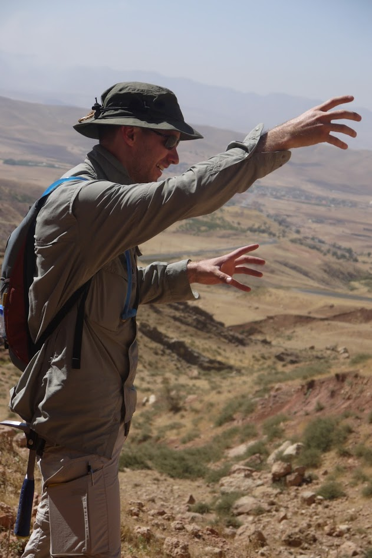
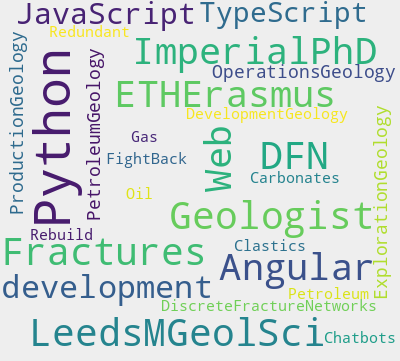
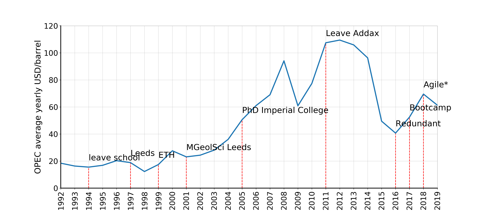
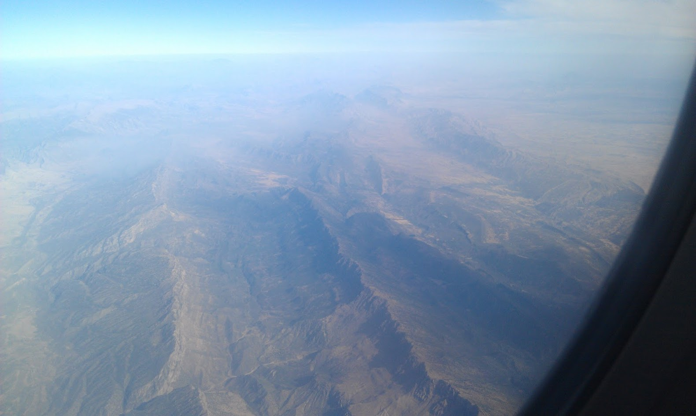
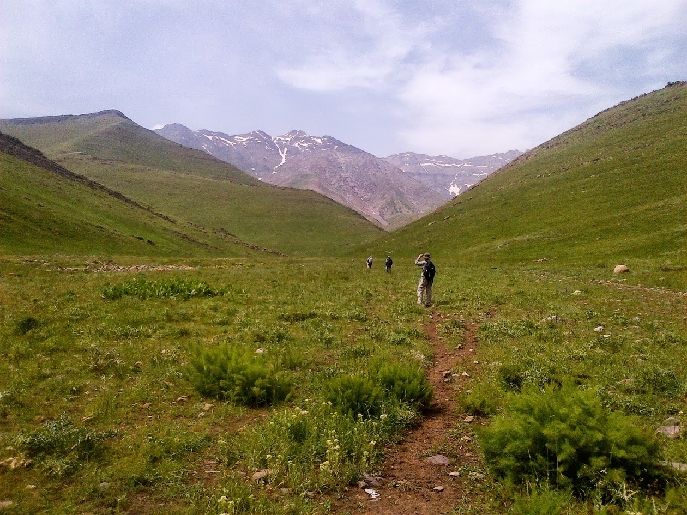
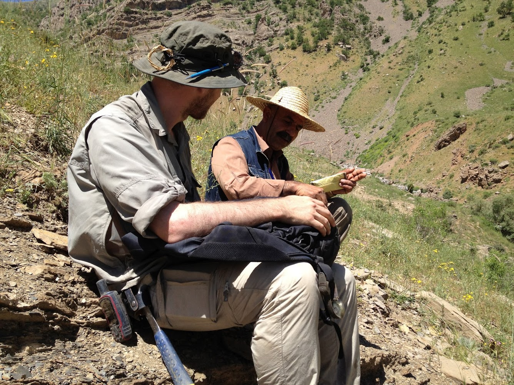
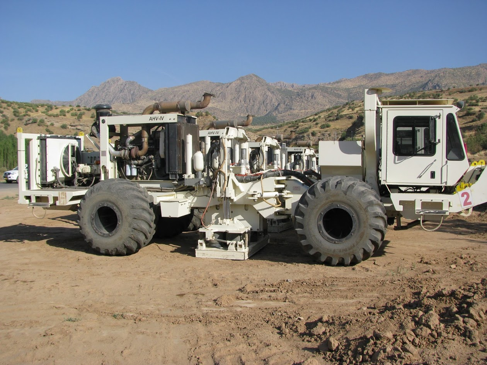
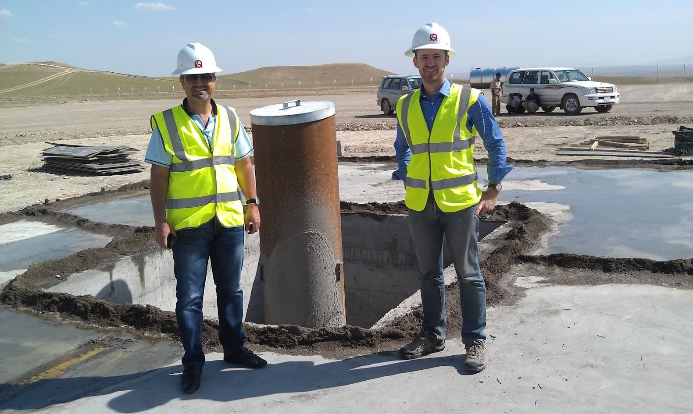
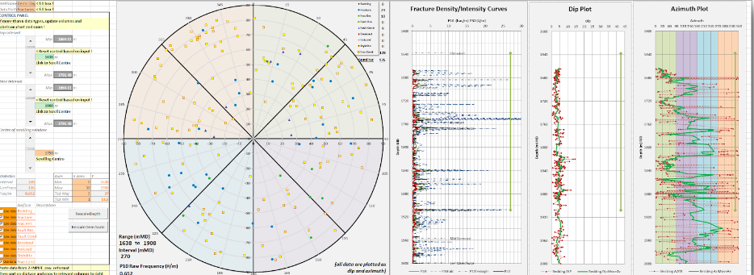

# Field Trips and CodeBytes
## A journey into Digital Geosciences

Robert Leckenby

ETH Zürich - May 2019

<!-- .slide: data-background="./images/Agile_logo.png" -->

---

---

### Rob's oil price rollercoaster

Note: My journey so far, cycles of reinvention, geology in different oil price settings, bouncing back

----

### Gara Anticline, Iraqi Kurdistan

Note: One of my many trips into Kurdistan, as geologists we see these mountains differently to most people, as petroleum geologists, even more differently

----

### Kurra Chine Formation, Iraqi Kurdistan

Note: Field work sometime looks so quiet and peaceful, here we were just out of range of Turkish snipers and staying well away of their minefields, beware the long grass!

----

### Ora Valley, Iraqi Kurdistan

Note: chatting with the village Mukhtar - the head of the village. He tells me of war and peace, of smugglers carrying tea and ammunition accorss the border, and of playing on the Triassic rocks of the Kurra Chine formation

----

### Vibroseis in Sindi Amedi

Note: our JV partners (Perenco) shoot some 2D lines in the Sindi Amedi block, with steep carbonate cliffs, the seimic quality will not be very good. Field work is crucial to ground truth the interpretations

----

### DD-2 20in Conductor

Note: We are not a university, and so eventually this all leads to spudding our first well, this is the 20in conductor that was pile-driven in

----

##  Excel, Petrel, Fracman,...

Note: Building tools in excel when my company hadn't yet bought fracture modelling software - and even then, I still did my analysis here as the software didn't do what I needed >> first steps on FOSS road

---

### So that's me, how about you?

Go to [www.menti.com](https://www.mentimeter.com/app) and use the code I'll give to you

Note: just a way to get to know the audience: open https://www.mentimeter.com/app and get the code from there

----

## Demo - the beginnings

- https://obsidiancode.io
- https://telegram.me/geoLearnBot

Note: the slow and humble beginnings, learning a new job at 40 years old.

---

## Python Demos

- [demos](https://github.com/Zabamund/misc/tree/master/scripts/demos)
- [mini tutorials](https://github.com/Zabamund/misc/tree/master/scripts/minitutos)
- [Stacked fracture azimuth plots](https://github.com/Zabamund/misc/blob/master/scripts/demos/KDE_smoothing.ipynb)
- [Scrolling seismic](https://github.com/Zabamund/misc/blob/master/scripts/demos/Intro_to_interact.ipynb)
- [Fracture analysis](https://github.com/Zabamund/fracture-SFA)

Note: getting into the fun parts

---

## Live demo

interactive fracture analysis in a Jupyter notebook

Note: live coding demo

---

## References

[reveal-md](https://github.com/webpro/reveal-md)

[mentimeter.com](https://www.mentimeter.com)

[agilescientific.com](https://agilescientific.com)

[softwareunderground.org](https://softwareunderground.org)

[my github](https://github.com/Zabamund)

[word_cloud](https://github.com/amueller/word_cloud)

[jupyter.org](https://jupyter.org/)

---

## Thank you!

[agilescientific.com](https://agilescientific.com)

[agilescientific.com/blog](https://agilescientific.com/blog)

[softwareunderground.org](https://softwareunderground.org)

Note: thank Philippo, Agile*, and the audience of course. Point them to SWUNG. MENTIMETER

<!-- .slide: data-background="./images/Agile_logo.png" -->
